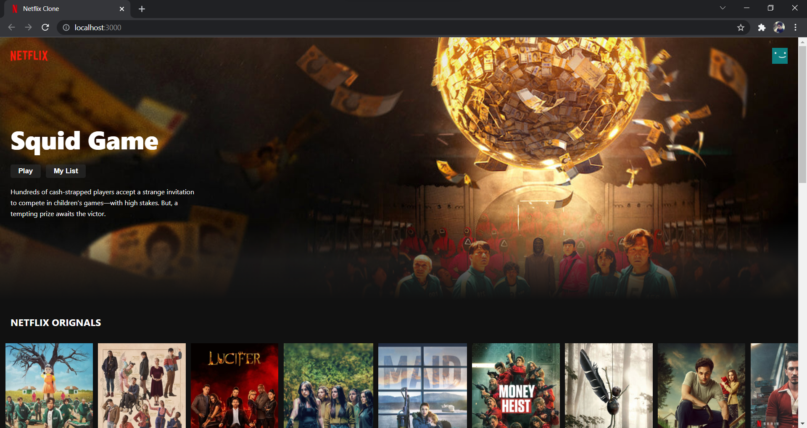
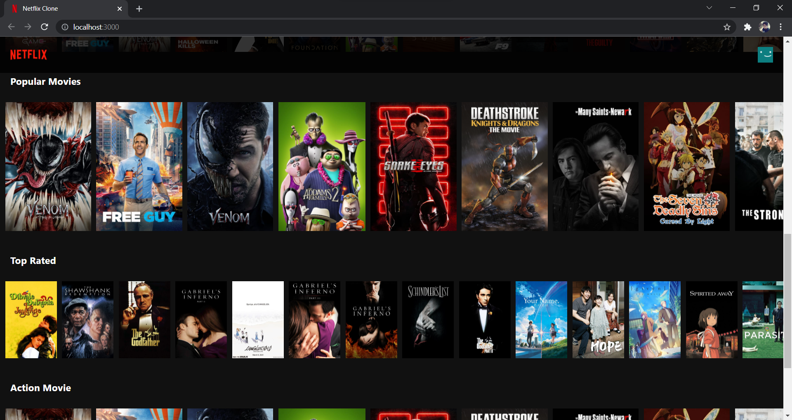

# Netflix Clone ⚡

It is created using React.js

## How to run this application
### `npm install`
Run the command npm start in oder to install all the relevant packages in your computer.

### `npm run start`
After the installation just run the command npm run start.

### `Limitations` 😄
This application only plays the trailers of the series/movie produced by Netflix.

## **Features 😎🗻:**
  **1> You can search for different Netflix Orignal shows**
  
  **2> You can view trailers of the series/movies produced by Netflix**
  
  **3> You can see the trending shows,action movies and top rated movies at one place**

## **Project Screenshots :**

***

<h3 align=center> Home Page</h3>

<h3 align=center> Other Sections</h3>

***

<h2 align="center">Made With 💖 By Farhan Khan</h2>

***
***